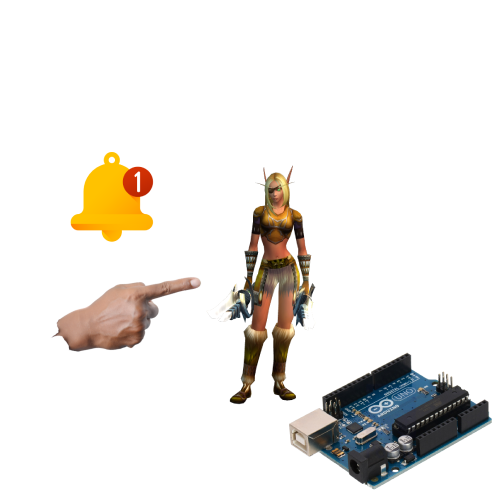
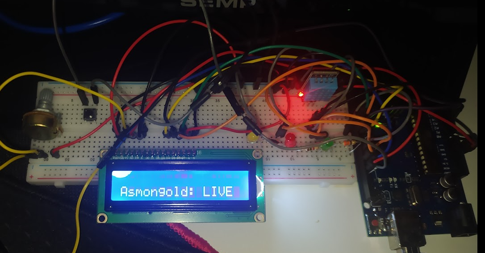

# ASMONGOLD LIVE ALERT


Basically using an Arduino connected to an LCD monitor to monitor when Asmongold opens the live and notifies me through the display and LEDs. It is also possible to check the room temperature and enter chat mode where you can check messages with up to 17 characters in real time! watch the [demo](https://www.youtube.com/watch?v=jSCvhmO6pDA) video!



Bonus: It is also possible to monitor a world of warcraft player who is your friend to find out if they have gone online specifically on [warmane](https://www.warmane.com/)

# If you found the project idea interesting and want to support me in some way, click on the link below and buy me a coffee or contact me

[](https://www.buymeacoffee.com/cybermazinho)

 [Send a message via Telegram](https://t.me/cybermazinho)

# INSTALLING

**Step 1:** Install Python

Make sure you have Python installed on your system. [Download here](https://www.python.org/), checking the "Add Python to PATH" option during installation.

**Step 2:** Clone the Repository

```bash
git clone git@github.com:cybermazinho/asmongold_live_alert_project.git
```

```bash
cd seu_projeto
python -m venv venv
```

```bash
venv\Scripts\activate
```

```bash
venv\Scripts\activate
```

```bash
source venv/bin/activate
```

```bash
pip install -r requirements.txt
```

```bash
python script.py
```

**Step 3:** Arduino

You will transfer the code present in the file:

```bash
asmongold_alert_project.ino
```

To your Arduino and through the connection cable, the Python script will send information to the Arduino(Serial mode)

**Required hardware:**

- 1 Arduino uno R3
- 1 Display LCD 16x2
- 1 DHT11 sensor
- 3 LEDS difuso
- 1 Protoboard
- 1 Potentiometer
- Male-to-male jumpers
- 3 220 ohm or 120 ohm resistor
- 1 Push Button

**Guides for Arduino connections to sensors if you are a beginner:**

 - [Connecting the Arduino to the LCD display](https://www.makerhero.com/blog/controlando-um-lcd-16x2-com-arduino/)
 - [Connecting the Arduino to the DHT11](https://blogmasterwalkershop.com.br/arduino/como-usar-com-arduino-sensor-de-umidade-e-temperatura-dht11)
- [Connecting the Arduino to the LEDS](https://tecdicas.com/como-acender-e-piscar-um-led-no-arduino/)
- [Connecting the Arduino to the Push Button](https://www.blogdarobotica.com/2020/09/28/ligar-e-desligar-led-com-botao-push-button-chave-tactil-com-arduino/)


# THIS CABLE MESS IS DEPLORABLE BUT AS CURRENTLY THE PROJECT APPEARS TO BE:

